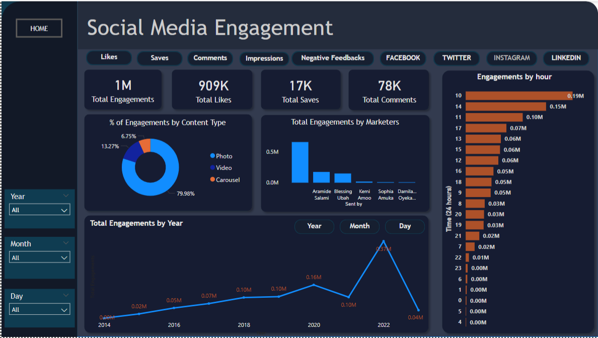
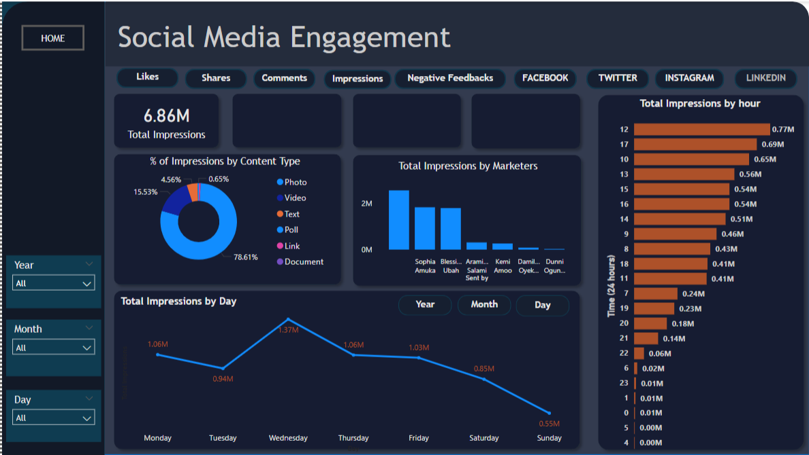
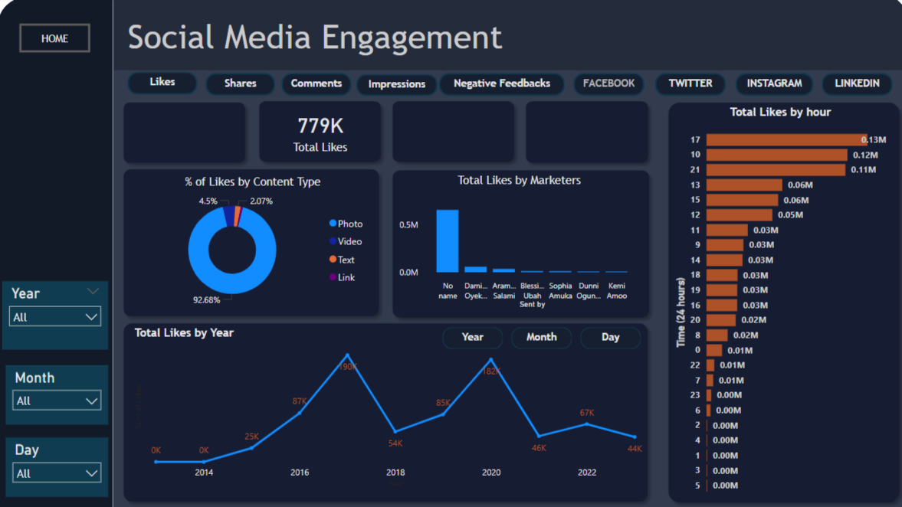
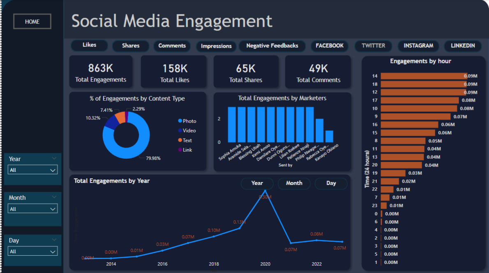

## 📊 Descriptive Analysis Overview

As part of the initial exploratory phase, a detailed **descriptive analysis** was conducted to understand the structure, distribution, and relationships within the dataset. The key focus areas included identifying trends, highlighting outliers, and summarizing statistical features across relevant variables.

This phase was instrumental in uncovering foundational insights and informing subsequent steps in the analysis pipeline. The following visualizations showcase some of the core descriptive findings:

---

### 🧮 1. Distribution of the Target Variable

The histogram above provides a comprehensive view of how the target variable is distributed across the dataset. This helps in understanding class imbalance, which is critical for designing effective predictive models. As seen, there is a significant skew toward one class, indicating the need for appropriate resampling techniques or performance metrics during modeling.

---

### 📈 2. Temporal Trends and Patterns

This time-series line chart illustrates the temporal behavior of transaction frequency (or relevant metric) over the recorded period. Peaks and troughs indicate seasonal patterns and potential anomalies. This insight is especially useful when working with time-sensitive data like financial transactions or web activity.

---

### 🧭 3. Correlation Heatmap of Key Variables

The correlation heatmap visually presents the strength and direction of relationships between selected numerical variables. Strong positive and negative correlations were identified, offering direction for feature selection, dimensionality reduction (e.g., PCA), and multicollinearity considerations in regression models.

---

### 🧱 4. Category-Wise Feature Summary

This bar chart dissects how different categorical groups (such as regions, user types, or product classes) compare across a selected numerical metric. It helps identify dominant contributors or underrepresented groups, guiding potential feature engineering efforts.

---

## 🔍 Summary

These visualizations form the backbone of the **descriptive statistics phase**, providing both a quantitative and visual summary of the dataset. They establish a context for further inferential and predictive analytics by:

- Highlighting distributional anomalies,
- Revealing inter-feature relationships,
- Uncovering temporal dynamics,
- And pinpointing significant categorical variations.

Each visualization is designed to be intuitive and interpretable, serving both technical and non-technical stakeholders.

---
